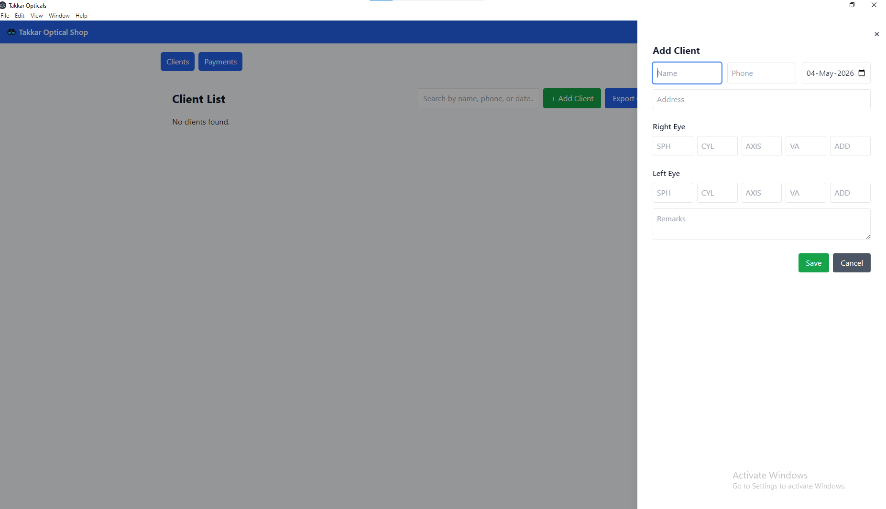
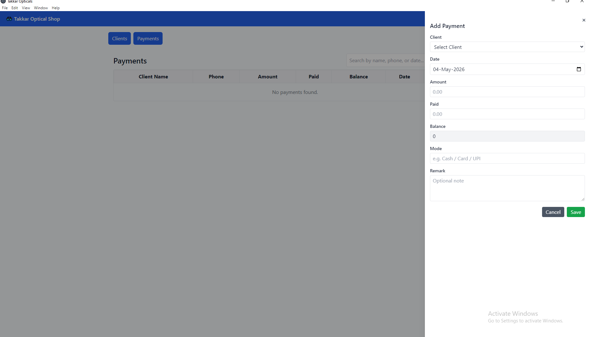

# Electron Optical Shop (React + Tailwind + sqlite3)

This scaffold uses sqlite3 (no native compilation required on Node 22+) and Vite + React + Tailwind for renderer.

To run (Windows):
1. Install Node.js (>=18 recommended). If using Node 22, sqlite3 works with prebuilt binaries.
2. In project root run:
   npm install
3. Install renderer deps:
   cd renderer
   npm install
   cd ..
4. Start in dev mode:
   npm start
5. Build & package (produces installer using electron-builder):
   npm run build

If you encounter native build errors for sqlite3, try Node 20 LTS or run on GitHub Actions (windows-latest) to create installer.

## 📸 Screenshots

### 🖥️ Client

---

### 📅 Payment

## License

This project is proprietary and is not open for public use, distribution, or modification without explicit permission from the author.

© Vishav Bandhu. All rights reserved.
For commercial usage or licensing inquiries, 
please contact: mr.kaith@gmail.com Website:https://www.itsbegin.in/
